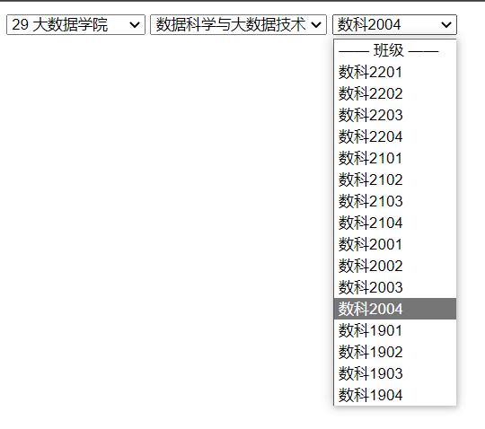

# 太原理工大学学院专业班级选择前端模板

#### 介绍
采用python生成
就像选择省市区一样快速选择专业班级！
前端模版基于[https://github.com/fengyuanchen/distpicker](https://github.com/fengyuanchen/distpicker)


#### 截图预览
在线Demo：[https://zhaokugua.github.io/tyut_major_class_choose/](https://zhaokugua.github.io/tyut_major_class_choose/)



#### python生成源码
基于[pytyut](https://gitee.com/jixiaob/pytyut)从教务系统获取最新数据

```python
    zkg = pytyut.Pytyut('学号', '密码', node_link='auto', login=True, debug=True)
    json_tree = zkg.get_major_class_tree(zkg.get_now_xnxq())
    print('json树信息获取完成！')
    json_result = {
        100000: {},
    }  # 初始化所有学院100000
    xueyuan_name = ''
    zhuanye_name = ''
    xueyuan_list = []  # ['软件学院', '大数据学院']
    # 学院编号从11开始，依次递增（index + 11）
    zhuanye_list = {}  # {'软件学院': ['软件工程'], '大数据学院':['数据科学与大数据技术', '人工智能']}
    # 每个学院的专业编号从11开始，依次递增(index + 11)
    for info in json_tree:
        if info['id'].count('_') == 0:  # 年份
            pass
        elif info['id'].count('_') == 1:  # 学院
            xueyuan_name = info['name']
            # 检查是否已经有这个学院
            if xueyuan_name in xueyuan_list:
                pass
            else:
                zhuanye_list[xueyuan_name] = []  # 初始化专业列表的学院
                xueyuan_list.append(xueyuan_name)
                json_result[100000][int(f'{xueyuan_list.index(xueyuan_name) + 11}0000')] = xueyuan_name  # 更新学院字典
                json_result[int(f'{xueyuan_list.index(xueyuan_name) + 11}0000')] = {}  # 初始化学院对应的专业字典
        elif info['id'].count('_') == 2:  # 专业
            zhuanye_name = info['name']
            if zhuanye_name in zhuanye_list[xueyuan_name]:  # 查看专业是否已存在
                # json_result['data'][xueyuan_list.index(xueyuan_name)]['major'][0][zhuanye_name].append(banji_name)
                # zhuanye_list[xueyuan_name] = []  # 初始化专业列表
                pass
            else:
                zhuanye_list[xueyuan_name].append(zhuanye_name)
                xueyuan_code = f'{xueyuan_list.index(xueyuan_name) + 11}'
                zhuanye_code = f'{zhuanye_list[xueyuan_name].index(zhuanye_name) + 11}'
                json_result[int(f'{xueyuan_code}0000')][int(f'{xueyuan_code}{zhuanye_code}00')] = zhuanye_name  # 更新学院对应的专业字典
                json_result[int(f'{xueyuan_code}{zhuanye_code}00')] = {}  # 初始化专业对应班级的字典
            # print(year, college, info['name'], num_dict[year], num_dict[college])
        elif info['id'].count('_') == 3:  # 班级
            banji_name = info['name']
            xueyuan_code = f'{xueyuan_list.index(xueyuan_name) + 11}'
            zhuanye_code = f'{zhuanye_list[xueyuan_name].index(zhuanye_name) + 11}'
            if banji_name in json_result[int(f'{xueyuan_code}{zhuanye_code}00')].values():
                banji_code = f"{list(json_result[int(f'{xueyuan_code}{zhuanye_code}00')].values()).index(banji_name) + 11}"
                print('这条代码怎么会执行呢？？？')
            else:
                banji_code = f"{len(json_result[int(f'{xueyuan_code}{zhuanye_code}00')]) + 11}"  # 新建班级编号
            json_result[int(f'{xueyuan_code}{zhuanye_code}00')][int(f'{xueyuan_code}{zhuanye_code}{banji_code}')] = banji_name  # 更新专业对应班级的字典

        else:
            pass
    with open('major_class_json.json', 'w+', encoding='utf8') as f:
        f.write(str(json_result))
    print('喵')
```
